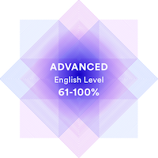

# Alexander Kharmansky
21 y.o., Simferopol, Crimea

***

### Contact information

__Telegram:__ @davilex_x  
__Phone:__ +7 (978) 250-68-31  
__E-mail:__ andro.front99@gmail.com

***

### About me

I've been studying basics of web development for one and a half years now. Unfortunately, I've never tried to work on a project with team, but really looking forward to. Right now I'm constantly learning and improving my frontend developer skills, especially JavaScript. My goal is to always learn new things and be useful.

***

### Skills
* HTML5
* CSS3
* Sass
* Bootstrap
* JavaScript basics
* React basics
* Git, Github
* VS Code
* Adobe Photoshop, Figma, Sketch

***

### Code example

```javascript
var array = [
    {name: "Ivanov O. V.", value: 10},
    {name: "Ivanov Oleg Ivanovich", value: 5},
    {name: "Ivanov Ilya Petrovick", value: 10},
    {name: "Petrov Pyotr Petrovich", value: 15},
    {name: "Sidorov Sergey Ivanovich", value: 10},
    {name: "Sidorov Ivan Ivanovich ", value: 10},
];

var groupByNames = array.reduce((total, item) => {

    var splittedNames = item.name.split(" ");
    var slicedNames = splittedNames.slice(0, 1);
    total[slicedNames] = (total[slicedNames] || 0) + item.value;
    return total;

}, {});

console.log(groupByNames);
```

***

### Courses and work experience
* finished HTML & CSS advanced course at Glo Academy (former HTML Academy by Artyom Islamov) in 2017
* finished preparatory course at Gorbunov's Bureau Design School
* test task for one company I did this year: https://alexkharmansky.github.io/all.ca/ (different Github name since it blocked some functionality because of limitations on Crimea region including private repositories)

***

### Education
* finished 9th grade of K. D. Ushinsky Gymnasium №1 in 2014
* finished V. I. Vernadsky Taurida College in 2018, Computer Programming specialty
* finished V. I. Vernadsky Crimean Federal University in 2021, bachelor, Applied Mathematics and Computer Science specialty
_Note that both diplomas and primary education certificate not recognized by the world community (except Russia) since they were issued on disputed territory_

***

### Languages
* English - B1 Intermediate/B2 Upper Intermediate

* Russian - Native
* Ukraininan - Upper Intermediate